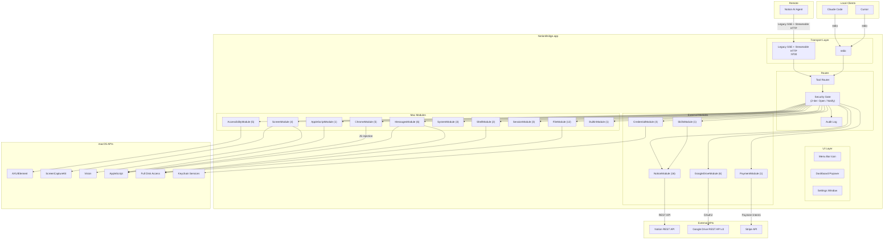

# NotionBridge

**A native macOS menu-bar app that turns your Mac into an MCP server for Notion AI agents.**

NotionBridge exposes local system capabilities — files, shell, screen, accessibility, messages, Chrome, Notion API, credentials, and more — as [Model Context Protocol](https://modelcontextprotocol.io/) tools that AI agents can call over HTTP. Built in Swift 6.2 as a lightweight menu-bar app targeting macOS 26 (Tahoe) on Apple Silicon.

**70 tools across 15 modules** · 3 transports (Streamable HTTP, legacy SSE, stdio) · 2-tier security model · Cloudflare Tunnel for remote access

---

## Table of Contents

- [Features](#features)
- [Architecture](#architecture)
- [Installation](#installation)
- [Configuration](#configuration)
- [Transport Configuration](#transport-configuration)
- [Security Model](#security-model)
- [Cloudflare Tunnel Setup](#cloudflare-tunnel-setup)
- [Permission Requirements](#permission-requirements)
- [Module & Tool Reference](#module--tool-reference)
- [Project Structure](#project-structure)
- [Build & Test](#build--test)
- [Dependencies](#dependencies)
- [Contributing](#contributing)
- [License](#license)

---

## Features

- **Menu-bar app** — runs silently in your menu bar with a status popover and settings window
- **Auto-launch** — starts on login via `SMAppService`, no manual intervention needed
- **64 MCP tools** across 14 modules covering files, shell, messages, screen, accessibility, Chrome, Notion API, Google Drive, credentials, payments, and more
- **3 transports** — Streamable HTTP + legacy SSE on `:9700` for remote agents, stdio for local clients (Claude Code, Cursor)
- **2-tier security** — every tool call is classified as Open (execute immediately) or Notify (macOS notification). Sensitive tools use a Request tier requiring explicit confirmation
- **Cloudflare Tunnel** — secure remote access via your own tunnel (e.g., `bridge.yourdomain.com`), zero hosted infrastructure
- **Multi-workspace Notion API** — 16 Notion tools with `NotionClientRegistry` for multiple workspace connections
- **Audit logging** — every tool call recorded with timestamp, tool name, tier, input/output summary, and duration

---

## Architecture

NotionBridge runs as a menu-bar app (`NSApplication`) with no dock icon. Transport layers accept MCP requests and route them through the `ToolRouter` → `SecurityGate` → target module pipeline.



**Data flow:** Remote agents connect via legacy SSE or Streamable HTTP on `:9700`. Local clients connect via stdio. All requests route through Tool Router → Security Gate → Audit Log → target module. NotionModule, GoogleDriveModule, SkillsModule, and PaymentModule make outbound network calls. All other modules interact with local macOS APIs only.

---

## Installation

### Requirements

| Requirement | Version | Notes |
|-------------|---------|-------|
| **macOS** | 26.0+ (Tahoe) | Required for ScreenCaptureKit, SMAppService |
| **Hardware** | Apple Silicon (M1+) | ARM64 only — no Intel builds |
| **Xcode** | 26.0+ | Swift 6.2 toolchain (build from source only) |
| **Git** | 2.39+ | For cloning the repository |

### Option 1: DMG (Recommended)

1. Download the latest `NotionBridge.dmg` from [Releases](https://github.com/user/keepr-bridge/releases)
2. Open the DMG and drag `NotionBridge.app` to `/Applications`
3. Launch NotionBridge — the onboarding wizard will guide you through initial setup
4. Grant the required [permissions](#permission-requirements) when prompted

### Option 2: Build from Source

```bash
# Clone the repository
git clone https://github.com/user/keepr-bridge.git
cd keepr-bridge

# Build the app bundle
make app

# Or build a DMG for distribution
make dmg

# Run tests
make test
```

The built app bundle is placed at `.build/NotionBridge.app`.

### First Launch

On first launch, NotionBridge will:

1. Show the **Onboarding Wizard** to configure permissions and connections
2. Register as a **login item** via `SMAppService` (auto-launch on boot)
3. Start the MCP server on port `9700`
4. Show a menu-bar icon with a status popover

---

## Configuration

NotionBridge stores its configuration at:

```
~/.config/notion-bridge/config.json
```

### Notion API Token

To use the 16 Notion tools, add your [Notion internal integration token](https://www.notion.so/my-integrations):

1. Open **Settings** → **Connections**
2. Click **Add Connection** and paste your integration token
3. The connection will be validated automatically

Multiple workspace connections are supported via `NotionClientRegistry`. All Notion tools accept an optional `workspace` parameter to target a specific connection.

### Google Drive

To use GoogleDriveModule:

1. Open **Settings** → **Connections**
2. Configure Google Drive OAuth2 credentials
3. Authenticate via the browser flow

### Environment Variables

| Variable | Default | Description |
|----------|---------|-------------|
| `NOTION_BRIDGE_PORT` | `9700` | HTTP server port |

---

## Transport Configuration

NotionBridge supports three MCP transports simultaneously:

### Streamable HTTP (Primary)

```
POST http://localhost:9700/mcp
Content-Type: application/json

{"jsonrpc":"2.0","method":"initialize","params":{...},"id":1}
```

The server returns a `Mcp-Session-Id` header — include it in subsequent requests.

### Legacy SSE (Notion Agents)

Notion's built-in MCP client uses the legacy split SSE transport:

```
GET  http://localhost:9700/sse        # Opens SSE stream
POST http://localhost:9700/messages   # Sends JSON-RPC messages
```

### stdio (Local Clients)

For Claude Code, Cursor, and other local MCP clients:

```json
{
  "mcpServers": {
    "notionbridge": {
      "command": "/Applications/NotionBridge.app/Contents/MacOS/NotionBridge",
      "args": ["--stdio"]
    }
  }
}
```

---

## Security Model

Every tool call passes through the **SecurityGate** before execution. Tools are classified into tiers:

| Tier | Behavior | Examples |
|------|----------|---------|
| **Open** | Execute immediately. No user interaction. Read-only or low-risk. | `file_read`, `ax_tree`, `screen_capture`, `notion_search`, `system_info` |
| **Notify** | Execute immediately. macOS notification logged. Write operations. | `file_write`, `notion_page_create`, `chrome_navigate`, `dir_create` |
| **Request** | Requires explicit confirmation before execution. High-impact operations. | `shell_exec`, `messages_send`, `applescript_exec`, `credential_save`, `payment_execute` |

### Auto-Escalation

Commands containing these patterns are automatically escalated or blocked:

- `rm` — deletion (escalated)
- `kill` — process termination (escalated)
- `sudo` — **hard blocked**, never executed
- `chmod 777` — open permissions (escalated)
- Pipe to `sh`/`bash`/`eval` — arbitrary execution (escalated)

### Forbidden Paths

Write operations are blocked for: `~/.ssh`, `~/.gnupg`, `~/.aws`, `.env` files, `/System`, `/Library` (write), application bundles.

### Audit Log

Every tool call is recorded in an append-only audit log with: timestamp, tool name, security tier, input summary, output summary, and duration.

---

## Cloudflare Tunnel Setup

Cloudflare Tunnel provides secure remote access without exposing ports to the internet.

### Prerequisites

```bash
# Install cloudflared
brew install cloudflared

# Authenticate with your Cloudflare account
cloudflared login
```

### Create a Tunnel

```bash
# Create a new tunnel
cloudflared tunnel create notion-bridge

# Configure the tunnel to forward to NotionBridge
cat > ~/.cloudflared/config.yml << EOF
tunnel: <TUNNEL_ID>
credentials-file: /Users/$USER/.cloudflared/<TUNNEL_ID>.json

ingress:
  - hostname: bridge.yourdomain.com
    service: http://localhost:9700
  - service: http_status:404
EOF

# Create a DNS record
cloudflared tunnel route dns notion-bridge bridge.yourdomain.com
```

### Run the Tunnel

```bash
# Start manually
cloudflared tunnel run notion-bridge

# Or install as a LaunchAgent for auto-start
cloudflared service install
```

### Connect Notion Agent

In your Notion workspace, configure the MCP connection URL:

```
https://bridge.yourdomain.com/sse
```

The tunnel forwards requests to `localhost:9700` where NotionBridge is listening.

---

## Permission Requirements

NotionBridge requires several macOS TCC (Transparency, Consent, and Control) grants to function:

| Permission | Used By | Why |
|------------|---------|-----|
| **Accessibility** | AccessibilityModule | AXUIElement API for UI inspection and actions |
| **Screen Recording** | ScreenModule | ScreenCaptureKit for screenshots, OCR, recording |
| **Full Disk Access** | FileModule, MessagesModule | File operations, Messages `chat.db` reads |
| **Automation** | AppleScriptModule, ChromeModule, MessagesModule | AppleScript control of apps (Chrome, Messages) |

> **Note:** Screen Recording permission requires weekly re-grant on macOS 15+. The Permission Manager in Settings detects grant status and guides re-authorization.

All permissions are requested during the onboarding wizard on first launch. Grant status (green/red) is visible in **Settings → Permissions**.

---

## Module & Tool Reference

### Overview

| # | Module | Tools | Description |
|---|--------|-------|-------------|
| 1 | **ShellModule** | 2 | Shell command execution and pre-approved script runner |
| 2 | **FileModule** | 12 | File system operations, directory management, clipboard |
| 3 | **AccessibilityModule** | 5 | macOS Accessibility API: AX tree, element inspection, actions |
| 4 | **ScreenModule** | 4 | Screenshots, OCR (Vision), screen recording (SCStream) |
| 5 | **ChromeModule** | 5 | Chrome tab control, page reading, JS execution, screenshots |
| 6 | **SystemModule** | 3 | System info, process listing, macOS notifications |
| 7 | **MessagesModule** | 6 | iMessage/SMS: search, read, chat threads, send |
| 8 | **NotionModule** | 16 | Full Notion API: pages, blocks, comments, search, queries |
| 9 | **SessionModule** | 3 | Session info, tool registry introspection, session clear |
| 10 | **AppleScriptModule** | 1 | In-process AppleScript execution via NSAppleScript |
| 11 | **BuiltinModule** | 1 | Connectivity test (echo) |
| 12 | **SkillsModule** | 1 | Fetch named skill pages from Notion with caching |
| 13 | **GoogleDriveModule** | 6 | Google Drive: list, search, read, upload, download, metadata |
| 14 | **CredentialModule** | 4 | macOS Keychain: save, read, delete, list credentials |
| 15 | **PaymentModule** | 1 | Stripe payment execution via stored payment methods |
| | **Total** | **70** | |

### ShellModule (2 tools)

| Tool | Tier | Description |
|------|------|-------------|
| `shell_exec` | request | Execute a shell command with optional timeout and working directory |
| `run_script` | request | Execute a pre-approved script from the scripts directory |

### FileModule (12 tools)

| Tool | Tier | Description |
|------|------|-------------|
| `file_read` | open | Read text content from a file |
| `file_write` | notify | Write text content to a file |
| `file_append` | notify | Append text content to an existing file |
| `file_copy` | notify | Copy a file or directory |
| `file_move` | notify | Move a file or directory |
| `file_rename` | notify | Rename a file or directory in place |
| `file_list` | open | List directory contents (recursive, hidden files) |
| `file_search` | open | Search for files by name substring |
| `file_metadata` | open | Get file/directory metadata (size, dates, type) |
| `dir_create` | notify | Create a directory with intermediate parents |
| `clipboard_read` | open | Read text from system clipboard |
| `clipboard_write` | open | Write text to system clipboard |

### AccessibilityModule (5 tools)

| Tool | Tier | Description |
|------|------|-------------|
| `ax_tree` | open | Dump the AX element hierarchy for an app |
| `ax_element_info` | open | Deep inspect a single AX element (attributes, actions, state) |
| `ax_find_element` | open | Search the AX tree by role, title, or label |
| `ax_perform_action` | notify | Perform an action on an AX element (press, setValue, focus) |
| `ax_focused_app` | open | Return the frontmost app name, bundle ID, PID, and focused element |

### ScreenModule (4 tools)

| Tool | Tier | Description |
|------|------|-------------|
| `screen_capture` | open | Capture screenshot of display, window, or region (PNG/JPG) |
| `screen_ocr` | open | Capture screen and extract text via Vision OCR |
| `screen_record_start` | notify | Begin screen recording (SCStream + AVAssetWriter, max 300s) |
| `screen_record_stop` | notify | Stop active recording and return file path |

### ChromeModule (5 tools)

| Tool | Tier | Description |
|------|------|-------------|
| `chrome_tabs` | open | List all open Chrome tabs across windows |
| `chrome_read_page` | open | Extract page content via JS (text or HTML, optional CSS selector) |
| `chrome_execute_js` | notify | Execute arbitrary JavaScript in a Chrome tab |
| `chrome_navigate` | notify | Navigate a tab to a URL or open a new tab |
| `chrome_screenshot_tab` | open | Capture visible Chrome tab content as PNG |

### SystemModule (3 tools)

| Tool | Tier | Description |
|------|------|-------------|
| `system_info` | open | macOS system information: OS, CPU, memory, hostname, uptime |
| `process_list` | open | List running processes with CPU%, MEM%, PID |
| `notify` | open | Send a local macOS notification |

### MessagesModule (6 tools)

| Tool | Tier | Description |
|------|------|-------------|
| `messages_search` | open | Search iMessage/SMS by keyword (SQLite on chat.db) |
| `messages_recent` | open | List recent conversations with last message preview |
| `messages_chat` | open | Get message thread with a specific contact |
| `messages_content` | open | Get a single message by ID with full metadata |
| `messages_participants` | open | List participants in a chat |
| `messages_send` | request | Send an iMessage or SMS/RCS via AppleScript |

### NotionModule (16 tools)

| Tool | Tier | Description |
|------|------|-------------|
| `notion_search` | open | Search workspace for pages and databases |
| `notion_page_read` | open | Read page properties and child blocks |
| `notion_page_create` | notify | Create a new page under a parent page or database |
| `notion_page_update` | notify | Update page properties |
| `notion_page_move` | notify | Move a page to a new parent |
| `notion_page_markdown_read` | open | Get page content as markdown |
| `notion_page_markdown_write` | notify | Replace page content from markdown |
| `notion_query` | open | Query a database with optional filter and sort |
| `notion_blocks_append` | notify | Append child blocks to a page or block |
| `notion_block_delete` | notify | Delete (trash) a block |
| `notion_comments_list` | open | List comments on a page or block |
| `notion_comment_create` | notify | Create a comment on a page |
| `notion_users_list` | open | List all workspace users |
| `notion_file_upload` | notify | Upload a local file to Notion (max 20MB) |
| `notion_token_introspect` | open | Introspect the current API token |
| `notion_connections_list` | open | List configured workspace connections with health status |

All Notion tools accept an optional `workspace` parameter for multi-workspace routing.

### SessionModule (3 tools)

| Tool | Tier | Description |
|------|------|-------------|
| `session_info` | open | Session uptime, connections, tool calls, active clients |
| `session_clear` | notify | Clear session state (audit log). Requires `confirm: true` |
| `tools_list` | open | Live tool registry with name, module, tier, description, schema |

### AppleScriptModule (1 tool)

| Tool | Tier | Description |
|------|------|-------------|
| `applescript_exec` | request | Execute AppleScript in-process via NSAppleScript |

### BuiltinModule (1 tool)

| Tool | Tier | Description |
|------|------|-------------|
| `echo` | open | Echo back input message (connectivity test) |

### SkillsModule (1 tool)

| Tool | Tier | Description |
|------|------|-------------|
| `fetch_skill` | open | Fetch a named skill (Notion page) by name with 10-minute caching |

Skills are configured in Settings → Skills. Each skill maps a name to a Notion page whose content is returned as text.

### GoogleDriveModule (6 tools)

> **Note:** GoogleDriveModule requires OAuth2 configuration in Settings → Connections. Tools are registered only when a Google Drive connection is active.

| Tool | Tier | Description |
|------|------|-------------|
| `gdrive_list` | open | List files in a folder |
| `gdrive_search` | open | Search files by name, type, or modification date |
| `gdrive_read` | open | Read file content (Docs→text, Sheets→CSV, other→raw) |
| `gdrive_download` | notify | Download a file to local path |
| `gdrive_upload` | notify | Upload a local file (single-part, max 10MB) |
| `gdrive_metadata` | open | Get file metadata, sharing info, and permissions |

### CredentialModule (4 tools)

| Tool | Tier | Description |
|------|------|-------------|
| `credential_save` | request | Store a credential in macOS Keychain (biometric auth required) |
| `credential_read` | request | Retrieve a stored credential by service and account |
| `credential_delete` | request | Remove a credential from Keychain (biometric auth required) |
| `credential_list` | notify | List stored credentials (metadata only, no secrets exposed) |

Card credentials are tokenized via Stripe before storage — raw card numbers never persist.

### PaymentModule (1 tool)

| Tool | Tier | Description |
|------|------|-------------|
| `payment_execute` | request | Execute a Stripe payment intent using a stored payment method |

---

## Project Structure

```
keepr-bridge/
├── NotionBridge/
│   ├── App/                          # Application lifecycle
│   │   ├── NotionBridgeApp.swift     # @main, MenuBarExtra
│   │   ├── AppDelegate.swift         # SMAppService, module loader
│   │   ├── StatusBarController.swift # Menu bar icon + popover
│   │   └── Resources/               # Icons, assets
│   ├── Config/
│   │   ├── ConfigManager.swift       # JSON config (~/.config/notion-bridge/)
│   │   └── ConnectionHealthChecker.swift
│   ├── Modules/                      # All tool modules
│   │   ├── ShellModule.swift
│   │   ├── FileModule.swift
│   │   ├── MessagesModule.swift
│   │   ├── SystemModule.swift
│   │   ├── NotionModule.swift
│   │   ├── SessionModule.swift
│   │   ├── AppleScriptModule.swift
│   │   ├── AccessibilityModule.swift
│   │   ├── ScreenModule.swift
│   │   ├── ChromeModule.swift
│   │   ├── GoogleDriveModule.swift
│   │   ├── SkillsModule.swift
│   │   ├── CredentialModule.swift
│   │   └── PaymentModule.swift
│   ├── Security/
│   │   ├── SecurityGate.swift        # 2-tier enforcement
│   │   ├── AuditLog.swift            # Append-only structured log
│   │   ├── PermissionManager.swift   # TCC detection + re-grant
│   │   ├── KeychainManager.swift     # SecItem CRUD wrapper
│   │   └── StripeClient.swift        # Payment tokenization
│   ├── Server/
│   │   ├── SSETransport.swift        # Legacy SSE + Streamable HTTP
│   │   ├── ToolRouter.swift          # Dispatch + security gating
│   │   └── ServerManager.swift       # Server lifecycle + echo tool
│   ├── UI/
│   │   ├── DashboardView.swift       # Main status popover
│   │   ├── SettingsWindow.swift      # Settings (General, Permissions, etc.)
│   │   ├── OnboardingWindow.swift    # First-launch wizard
│   │   ├── PermissionView.swift      # TCC grant status
│   │   └── ToolRegistryView.swift    # Tool list + filtering
│   ├── Notion/
│   │   ├── NotionClient.swift        # REST API client + backoff
│   │   ├── NotionClientRegistry.swift # Multi-workspace token registry
│   │   └── NotionModels.swift        # Page, Block, DB types
│   └── GoogleDrive/
│       ├── GoogleDriveClient.swift   # OAuth2 + URLSession client
│       └── GoogleDriveModels.swift   # Codable models
├── NotionBridgeTests/                # Test suites per module
│   ├── main.swift                    # Custom test harness runner
│   ├── *ModuleTests.swift            # Per-module test files
│   └── IntegrationTests/
│       └── EndToEndTests.swift
├── Package.swift                     # SPM manifest (swift-tools-version 6.2)
├── Makefile                          # app, dmg, clean, test, release
├── AGENTS.md                         # Agent development guidelines
├── NotionBridge.entitlements         # App sandbox entitlements
└── .github/                          # CI/CD workflows
```

---

## Build & Test

```bash
# Build release binary
swift build -c release

# Build .app bundle
make app

# Build DMG for distribution
make dmg

# Run all tests
make test

# Clean build artifacts
make clean
```

### Makefile Targets

| Target | Description |
|--------|-------------|
| `make app` | Build NotionBridge.app bundle |
| `make dmg` | Build distributable DMG |
| `make test` | Run full test suite |
| `make clean` | Remove build artifacts |
| `make release` | Build signed release (requires Apple Developer ID) |

---

## Dependencies

| Package | Version | Purpose |
|---------|---------|---------|
| [MCP Swift SDK](https://github.com/modelcontextprotocol/swift-sdk) | v0.11.0 | MCP protocol implementation + transports |
| [Swift NIO](https://github.com/apple/swift-nio) | 2.65.0 | Async networking (NIO event loops for SSE) |

All other functionality uses Apple system frameworks — no additional external dependencies.

---

## Contributing

Contributions are welcome! Here's how to get started:

1. **Fork** the repository
2. **Create a feature branch** from `main`: `git checkout -b feature/your-feature`
3. **Develop** your changes following the existing code patterns
4. **Write tests** — every module should have corresponding test coverage
5. **Run the test suite**: `make test`
6. **Submit a pull request** against `main`

### Development Guidelines

- **Trunk-based development** — `main` is always deployable. Feature branches are short-lived.
- **Swift 6.2 strict concurrency** — no `@unchecked Sendable` shortcuts.
- **Conventional commits** — use descriptive commit messages.
- **Security tiers** — new tools must declare their security tier in the module registration.
- **No force-push** to `main` without prior discussion.

### Adding a New Tool

1. Create or extend a module in `NotionBridge/Modules/`
2. Register the tool with its name, description, input schema, and security tier
3. Add test coverage in `NotionBridgeTests/`
4. Verify the tool appears in `tools_list` output after build

See [AGENTS.md](AGENTS.md) for detailed agent development guidelines.

---

## License

Copyright © 2026 Isaiah Peters. All rights reserved.

This software is proprietary. Distribution is available via direct purchase and Setapp.
